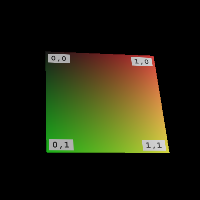

# glTF Sample Models

These sample models are used in the glTF tutorial. They are targeting glTF version 1.1
and will be updated to version 2.0 when the specification is finalized.

The `.gltf` files of these models are edited *manually*, to make the names and order 
of the properties match the descriptions in the tutorial. 

**All** these models are in the public domain ([CC0](https://creativecommons.org/publicdomain/zero/1.0/))

See the `README.md` in each model's directory for details.

| Model                                                  | Screenshot                                                      | Description|
|--------------------------------------------------------|-----------------------------------------------------------------|------------|
| [Triangle Without Indices](TriangleWithoutIndices)     |            | The simplest possible glTF asset: A single `scene` with a single `node` and a single `mesh` with a single `mesh.primitive` with a single triangle with a single attribute, without indices and without a `material` |
| [Triangle](Triangle)                                   |                          | A very simple glTF asset: The basic structure is the same as in [Triangle Without Indices](TriangleWithoutIndices), but here, the `mesh.primitive` describes an *indexed* geometry
| [Animated Triangle](AnimatedTriangle)                  |                  | This sample is similar to the [Triangle](Triangle), but the `node` has a `rotation` property that is modified with a simple `animation` |
| [Simple Material](SimpleMaterial)                      |                    | This sample is similar to the [Triangle](Triangle), but additonally defines a `material` that consists of an emissive color |
| [Simple Meshes](SimpleMeshes)                          |                      | A simple `scene` with two `nodes`, both containing the same `mesh`, namely a `mesh` with a single `mesh.primitive` with a single indexed triangle with *multiple* attributes (positions, normals and texture coordinates), but without a `material` |
| [Advanced Material](AdvancedMaterial)                  |                  | This sample is similar to the [Simple Meshes](SimpleMeshes), but defines a `material` that includes a light, and thus shows the effect of the normals attribute |
| [Simple Opacity](SimpleOpacity)                        |                     | A simple `scene` with multiple `nodes`, `meshes` and `materials`, where each `material` has different opacity values, ranging from fully transparent to fully opaque |
| [Simple Texture](SimpleTexture)                        |                     | A sample with a `material` that uses a single `texture` |
| [Cameras](Cameras)                                     |                           | A sample with two different `camera` objects |
| [Simple Skin](SimpleSkin)                              |                        | A sample with a `skin`, showing very basic vertex skinning. **Note: Parts of the skinning definitions still have to be finalized for glTF 1.1!** |
